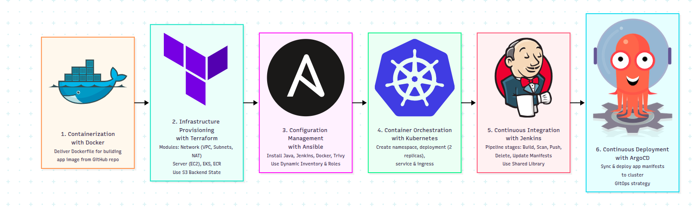

# Cloud DevOps Project

## Overview

This project implements a complete CI/CD pipeline on AWS following GitOps principles. The infrastructure is provisioned using Terraform, configured with Ansible, and orchestrated with Kubernetes on Amazon EKS. Jenkins is used for Continuous Integration, while ArgoCD handles Continuous Deployment by continuously synchronizing the cluster with the Git repository.

---

# Docker Stage

The first stage focused on containerizing the application using Docker. A Dockerfile was created to package the application and its dependencies into a portable image.

Containerization ensures that the application runs consistently across different environments and simplifies deployment to Kubernetes.

The Docker image produced in this stage is later used by the Jenkins pipeline and deployed inside the Kubernetes cluster.

---

# Infrastructure Provisioning with Terraform

Terraform was used to provision the AWS infrastructure using a modular approach.

The infrastructure consists of:

* A VPC with public and private subnets.
* Internet and NAT Gateways.
* A Jenkins EC2 instance.
* An Amazon ECR repository.
* An Amazon EKS cluster with managed worker nodes.
* IAM resources for the AWS Load Balancer Controller.

Terraform acts as the foundation of the project and provides the resources required by the following stages.

---

# Configuration Management with Ansible

After provisioning the infrastructure, Ansible was used to automate the configuration of the Jenkins server.

The configuration process uses:

* Dynamic inventory for automatic EC2 discovery.
* Java installation.
* Docker installation and configuration.
* Jenkins installation.
* Trivy installation for vulnerability scanning.

Using Ansible ensures that the server configuration is repeatable and eliminates manual setup.

The configured Jenkins server is then used for the Continuous Integration stage.

---

# Container Orchestration with Kubernetes

The application is deployed to Amazon EKS using Kubernetes.

The deployment consists of:

* A Deployment with two replicas for high availability.
* Pod Anti-Affinity rules to distribute Pods across different nodes.
* A ClusterIP Service for internal communication.
* An Ingress resource for external access.

The AWS Load Balancer Controller dynamically provisions an Application Load Balancer (ALB) and routes traffic directly to Pod IP addresses.

This architecture provides scalability, self-healing, and automatic traffic management.

---

# Continuous Integration with Jenkins

Jenkins automates the process of building and preparing application releases.

The pipeline consists of the following stages:

1. Build the Docker image.
2. Scan the image using Trivy.
3. Push the image to Docker Hub.
4. Delete the local image.
5. Update Kubernetes manifests with the new image tag.
6. Push the updated manifests to GitHub.

Reusable logic is implemented through Jenkins Shared Libraries to improve maintainability.

Instead of deploying directly to Kubernetes, Jenkins updates the Git repository, which becomes the single source of truth.

---

# Continuous Deployment with ArgoCD

ArgoCD implements GitOps-based Continuous Deployment.

An ArgoCD Application continuously monitors the GitHub repository and synchronizes the Kubernetes cluster with the manifests stored in Git.

Automatic synchronization enables:

* Continuous reconciliation.
* Self-healing.
* Configuration drift detection.
* Automatic pruning of obsolete resources.

Whenever Jenkins pushes updated manifests, ArgoCD detects the changes and deploys the new version automatically without requiring manual intervention.

---

# End-to-End Workflow

```text
Developer Pushes Code
        │
        ▼
Jenkins Builds Docker Image
        │
        ▼
Trivy Performs Security Scan
        │
        ▼
Docker Image Pushed to Docker Hub
        │
        ▼
Jenkins Updates Kubernetes Manifests
        │
        ▼
Changes Pushed to GitHub
        │
        ▼
ArgoCD Detects Changes
        │
        ▼
Kubernetes Cluster Synchronizes
        │
        ▼
Application Updated Automatically
```

---

# Technologies Used

* Docker
* Terraform
* AWS EC2
* Amazon ECR
* Amazon EKS
* Ansible
* Kubernetes
* AWS Load Balancer Controller
* Jenkins
* Trivy
* ArgoCD
* GitHub

---

# Project Architecture

```text
                    +----------------+
                    |    Developer   |
                    +----------------+
                             |
                             ▼
                    +----------------+
                    |     Jenkins    |
                    |   CI Pipeline  |
                    +----------------+
                             |
                             ▼
                    +----------------+
                    |   Docker Hub    |
                    +----------------+
                             |
                             ▼
                    +----------------+
                    |     GitHub      |
                    | Kubernetes YAML |
                    +----------------+
                             |
                             ▼
                    +----------------+
                    |     ArgoCD      |
                    +----------------+
                             |
                             ▼
                    +----------------+
                    | Amazon EKS      |
                    +----------------+
                             |
                             ▼
                    +----------------+
                    | Application Pods|
                    +----------------+
```

---

# Conclusion

This project demonstrates a complete Cloud DevOps workflow that combines Infrastructure as Code, Configuration Management, Container Orchestration, Continuous Integration, and GitOps-based Continuous Deployment.

By integrating Terraform, Ansible, Kubernetes, Jenkins, and ArgoCD, the platform provides an automated, scalable, and maintainable deployment pipeline capable of delivering applications reliably and efficiently.


